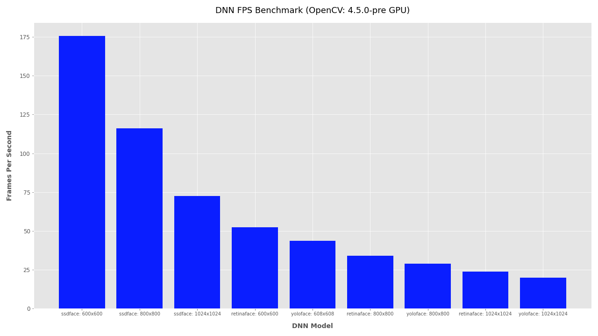
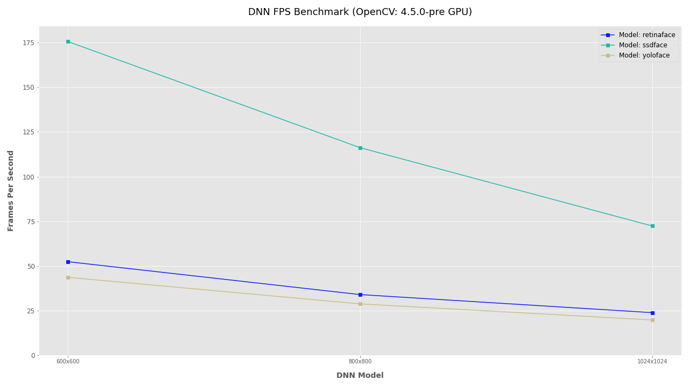
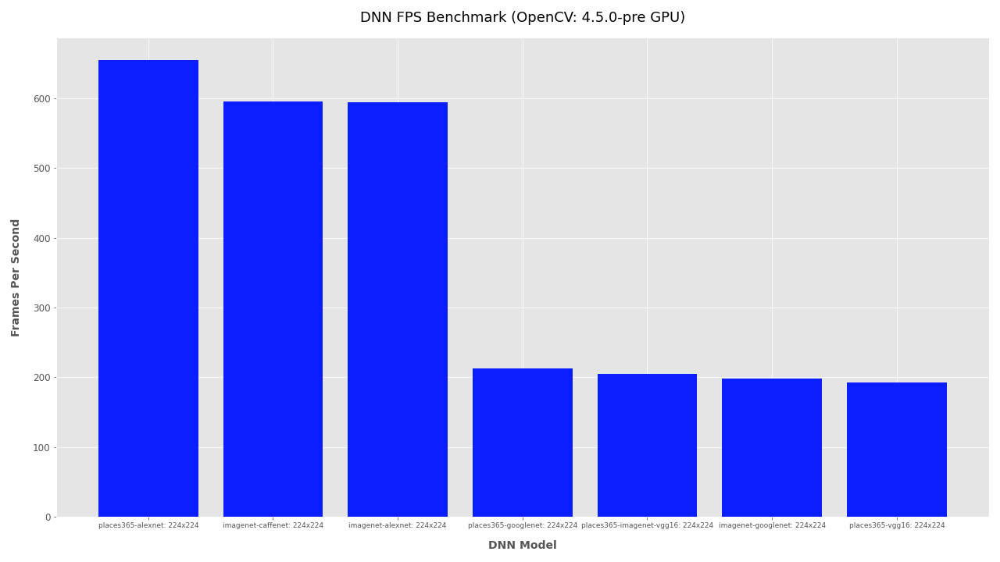

*This module is still under development. Code is subject to major changes.*

# Model Zoo

The Model Zoo is a collection of neural network computer vision models useful for inferring metadata about videos. It includes object detection and image classification with many more to come from VFRAME and contributors.

For compatibility and long term support, the Model Zoo aims to only use models that are compatible with OpenCV. For now this includes Caffe, Darknet, and TensorFlow models. More work is needed to port PyTorch/ONNX models. A few other model types are included for comparison (eg MXNet).


## ModelZoo Utility Scripts

List and download models
```
# list modelzoo commands
./cli.py modelzoo

# list models
./cli.py modelzoo list

# list models and group by attribute
./cli.py modelzoo list -g output

# download model (models also auto-download)
./cli.py modelzoo download -m imagenet-alexnet

# download all models
./cli.py modelzoo download --all

```

Test models
```
# run basic inference test
./cli.py modelzoo test -m imagenet-alexnet

# benchmark model fps
./cli.py modelzoo benchmark -m imagenet-alexnet

# benchmark model fps to csv
./cli.py modelzoo benchmark -m imagenet-alexnet -o ~/Downloads/benchmark.csv

# benchmark multiple models to csv
./cli.py modelzoo benchmark \
    -m imagenet-alexnet \
    -m imagenet-googlenet \
    -m imagenet-googlenet \
    -m places365-vgg16 \
    -m places365-imagenet-vgg16 \
    -o ~/Downloads/benchmark.csv
```


## Benchmarking

*Example bar plot comparing face detector models at multiple sizes using GTX 1080 Ti*

Multi-model multi-size benchmark bar plot
```
# generate data
./cli.py modelzoo benchmark \
    -m yoloface \
    -m ssdface \
    -m retinaface \
    --size 600 600 \
    --size 800 800 \            
    --size 1024 1024 \
    -o ~/Downloads/benchmark.csv

# plot
/cli.py modelzoo plot-benchmark -i ~/Downloads/benchmark.csv --type bar -f --xlabel-size 10
```


*Example line plot comparing face detector models at multiple sizes using GTX 1080 Ti*

```
# NB: if using YOLO models add the "--user-size" flag
# this avoids size discrepancies caused by YOLO auto-adjusting DNN inference sizes
./cli.py modelzoo plot-benchmark -i ~/Downloads/benchmark.csv --type line -f --xlabel-size 10 --user-size
```

*Example bar plot comparing classification models using GTX 1080 Ti*
```
/cli.py modelzoo benchmark \
    -m imagenet-caffenet \
    -m imagenet-alexnet \
    -m imagenet-googlenet \
    -m places365-googlenet \
    -m places365-alexnet \
    -m places365-vgg16 \
    -m places365-imagenet-vgg16 \
    --iters 50 \
    -o ~/Downloads/benchmark.csv

/cli.py modelzoo plot-benchmark -i ~/Downloads/benchmark.csv --type bar -f --xlabel-size 9
```

## Adding new models:

Config files for object detection will need the unconnected layers. Run the layers script to get a list of connected layers and their output size. For object detection use `--type unconnected`. For classification networks use `--type connected`. 

```
# object detection connected layers
./cli.py modelzoo layers -m coco --type unconnected

# image classification unconnected layers
./cli.py modelzoo layers -m places365-googlenet --type connected
```


## YAML Config Files

- Add the license tag code: https://docs.github.com/en/github/creating-cloning-and-archiving-repositories/licensing-a-repository#choosing-the-right-license


## Uploading New Models

If you want to host your own Model Zoo distribution server, use the upload script to synchronize models to your S3 server:
```
# upload (requires S3 account credentials in your .env)
./cli.py upload -m imagenet-alexnet
```


## Converting TensorFlow Models to OpenCV DNN

Under development. Further reading:
- https://medium.com/@sathualab/how-to-use-tensorflow-graph-with-opencv-dnn-module-3bbeeb4920c5
- https://github.com/tensorflow/tensorflow/blob/master/tensorflow/python/tools/freeze_graph.py
- https://github.com/nvnnghia/opencv-Image_classification
- https://github.com/opencv/opencv/wiki/TensorFlow-Object-Detection-API