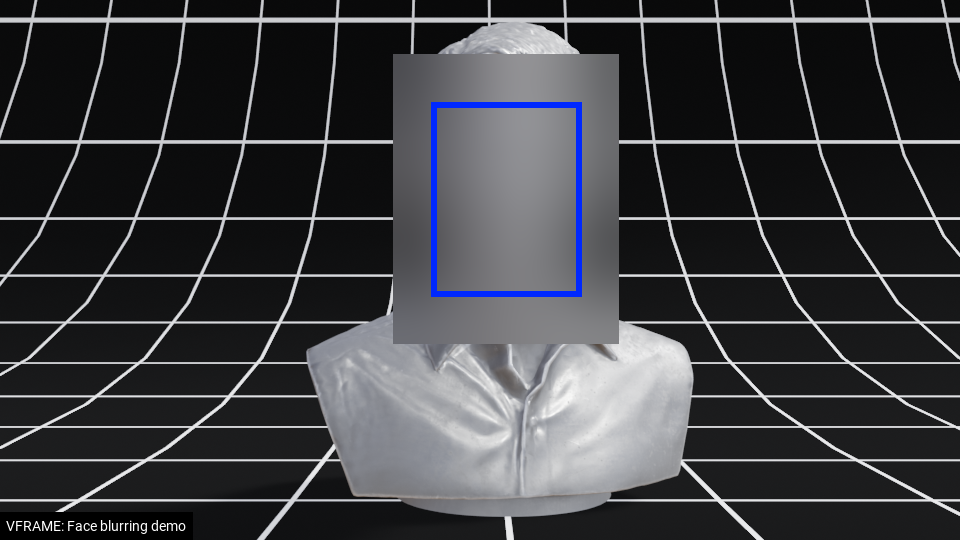

# Face Redaction



Use VFRAME to detect and redact faces in images and videos. Save the results to JPG, PNG, MP4, or as JSON data files. *This module is still under development. Syntax and features are subject to major changes.*

## Features:

- ModelZoo options: YOLOV4, RetinaFace, RetinaFaceLight, and SSD MobileNet detection models
- Export options: save to image, croplets, video, or JSON
- GPU options: CUDA acceleration if OpenCV compiled with CUDA enabled
- Merge options for using multiple models in ensemble

## Detect and Blur Face in Image or Video

First, source the filepaths environment variables
```
# source environment variables used for examples
source ../data/examples/filepaths.sh
```

Simple face detection for image
```
# Detect faces and display
./cli.py pipe open -i $FP_SNOWDEN_X1 detect -m yoloface draw display

# Detect faces and display
./cli.py pipe open -i $FP_SNOWDEN_X1 detect -m ssdface draw display

# Detect faces and display
./cli.py pipe open -i $FP_SNOWDEN_X1 detect -m retinface draw display
```

Simple face detection for video

```
 # Detect and blur faces in a video (add no-pause to autoplay)
./cli.py pipe open -i $FP_SNOWDEN_X1_VIDEO detect -m yoloface draw display --no-pause --delay 50
```


## Save Blurred Images


## Detect and Blur Face in Video

Simple face blurring for single image
```
# Detect and blur faces and save to new file
./cli.py pipe open -i $FP_SNOWDEN_X1 detect -m yoloface blur save-images -o $DIR_IMAGES_OUT --suffix _redacted -e png

# Detect and blur faces and save to new file, draw face bbox
./cli.py pipe open -i $FP_SNOWDEN_X1 detect -m yoloface blur draw save-images -o $DIR_IMAGES_OUT --suffix _redacted_bbox -e png

# rewritten as multi-line command for clarify
./cli.py pipe \
  open -i $FP_SNOWDEN_X1 \
  detect -m yoloface \
  blur \
  draw \
  save-images -o $DIR_IMAGES_OUT --suffix _redacted_bbox -e png
```


Blur Directory of Images or Videos 
```
# Directory of JPG images
./cli.py pipe open -i ../data/images/ --exts jpg \
              detect -m yoloface \
              blur \
              save_image -o ~/Downloads/ --suffix _redacted

# Directory of MP4 videos
./cli.py pipe open -i ../data/images/ --exts mp4 \
              detect -m yoloface \
              blur \
              save_video -o ~/Downloads/ --suffix _redacted
```

Expand BBox (for example, to cover ears)
```
# Expand the bounding box to blur more than the face
./cli.py pipe open -i ../data/media/input/samples/faces.jpg \
              detect -m yoloface \
              blur --expand 0.5 \
              display
```


## Example: Blur Faces and Export Detections to JSON

Blur all faces in a video and export to JSON file
```
# Blur faces in a single image
./cli.py pipe open -i ../data/media/input/samples/faces.mp4 \
              detect -m yoloface \
              blur \
              save_data -o ../data/media/output/
```


## Intermediate Examples

Blur Faces and Save to JSON
```
# Blur faces in a single image
./cli.py pipe open -i ../data/media/input/samples/faces.mp4 \
              detect -m yoloface \
              blur \
              save_data -o ../data/media/output/faces.json
```


## Advanced Examples

Detector ensemble
```
# Merge detections from multiple models
./cli.py  pipe \
       open -i ../data/media/input/samples/faces.jpg \
       detect -m yoloface \
       detect -m ssd \
       merge --to face \
       blur \
       draw -c 255 255 255 \
       display
```

Multi-detector ensemble with post-processing NMS:
```
#!/bin/bash
# save this to detect.sh and run "bash detect.sh"

FP_VIDEOS=/path/to/videos
FP_DETECTIONS=/path/to/detections
GPU=0  # choose GPU index

export CUDA_VISIBLE_DEVICES=${GPU}; ./cli.py pipe \
       open -i ${FP_VIDEOS} -e mp4 --slice 0 1 \
       resize -w 960 -f original \
       detect -m retinaface -n retinaface_0 \
       detect -m retinaface -r 90 -n retinaface_90 \
       detect -m retinaface -r 270 -n retinaface_270 \
       merge --to retinaface  \
       save_data -o ${FP_DETECTIONS}/retinaface.json

export CUDA_VISIBLE_DEVICES=${GPU}; ./cli.py pipe \
       open -i ${FP_VIDEOS} -e mp4 --slice 0 1 \
       resize -w 960 -f original \
       detect -m yoloface -n yoloface_0 \
       detect -m yoloface -r 90 -n yoloface_90 \
       detect -m yoloface -r 270 -n yoloface_270 \
       merge --to yoloface \
       save_data -o ${FP_DETECTIONS}/yoloface.json

export CUDA_VISIBLE_DEVICES=${GPU}; ./cli.py pipe \
       open -i ${FP_VIDEOS} -e mp4 --slice 0 1 \
       resize -w 960 -f original \
       detect -m ssdface -n ssdface_0 \
       detect -m ssdface -r 90 -n ssdface_90 \
       detect -m ssdface -r 270 -n ssdface_270 \
       merge --to ssdface \
       save_data -o ${FP_DETECTIONS}/ssdface.json

```

If GPU has low RAM run each command separately
```
#!/bin/bash
# save this to detect.sh and run "bash detect.sh"

FP_VIDEOS=/path/to/videos
FP_METADATA=/path/to/metadata
DETECTORS=(yoloface retinaface ssdface)
ROTS=(0 90 270)

for DETECTOR in ${DETECTORS}; do
  for ROT in ${ROTS}; do
    ./cli.py pipe \
    open -i ${FP_VIDEO} -e mp4  \
    resize -w 960 -f original \
    detect -m ${DETECTOR} -n ${DETECTOR}_${ROT} -t 0.6 \
    save_data -o ${FP_METADATA}/${DETECTOR}_${ROT}.json
  done
done
```

If you're on a remote computer, create a tmux session to monitor:
```
tmux new -s detect
conda activate vframe
# run above script
# detach: ctl+b then d
# reattach: tmux a -t detect
```

Then merge the JSON files
```
./cli.py dev merge_json -i ${FP_METADATA} -o ${FP_METADATA}/merged.json
```

Then blur the videos uses pre-computed detections
```
FP_OUT=/path/to/videos_blurred/
./cli.py pipe \
  open -i ${FP}/merged.json \
  blur \
  draw -C 255 255 255 \
  save_video -o ${FP}
```


## Example: Detect Small Faces

By default, the detectors use the image size settings in the ModelZoo YAML configuration files. These are general settings and should be tailored to your media. Supply a `--width` or `--height` argument to increase or decrease the input size. Increasing the input size helps detect smaller faces but is more computationally intensive. Decreasing the input size detects less smaller faces, but is faster.

```
# Increase size (slows down, but detects more small faces)
./cli.py pipe open -i ../data/media/input/samples/faces.jpg \
              detect -m yoloface --width 960 \
              blur \
              display

# Decrease size (speeds up, but detects less small faces)
./cli.py pipe open -i ../data/media/input/samples/faces.jpg \
              detect -m yoloface --width 448 \
              blur \
              display
```


## Credits

Development of the VFRAME face blurring tools was supported by NL Net Privacy Enhancing Technologies during 2019 - 2020.


Research and development: Adam Harvey, VFRAME